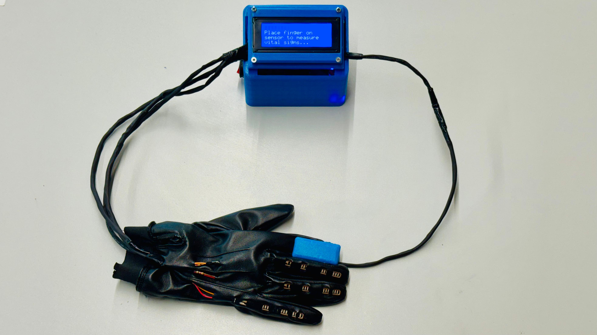
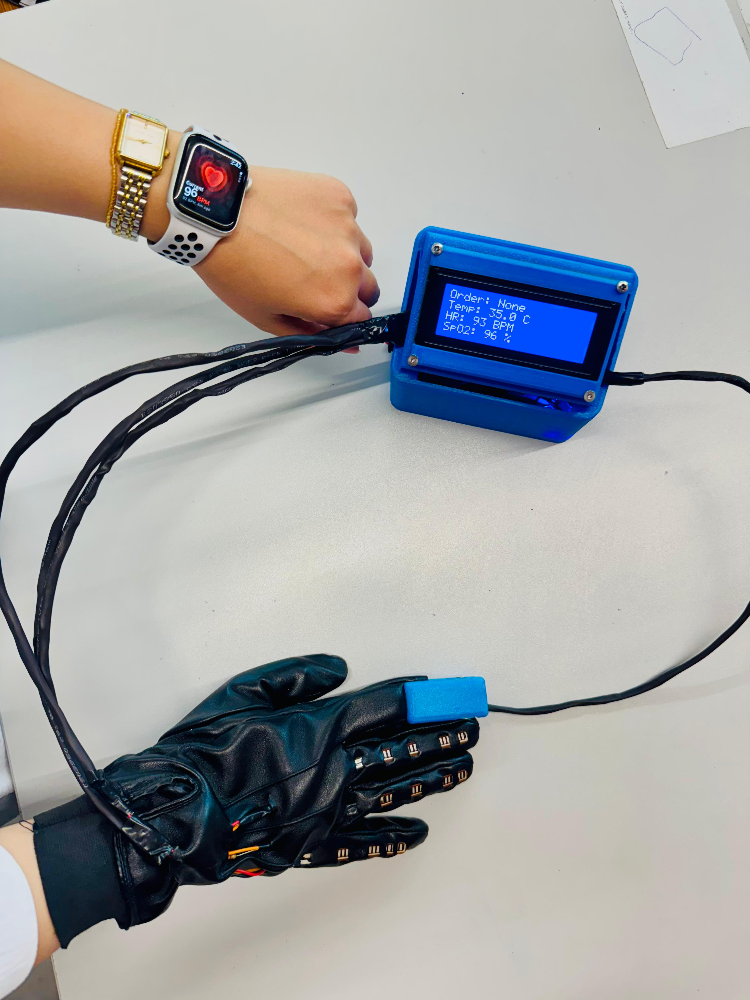
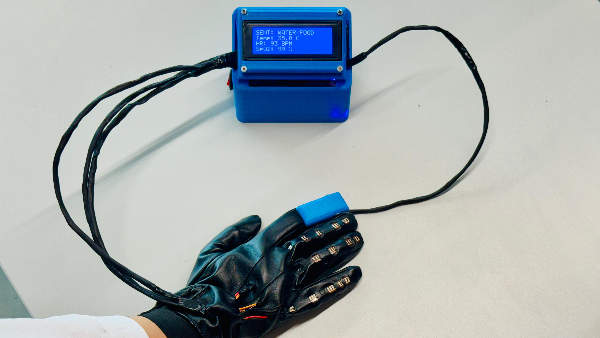

# 🧤 Smart Health Glove — Non-Verbal Emergency System for Paralysis Patients

> A wearable IoT device that gives paralysis patients a voice when they have none.  
> Built with ESP32 · MAX30102 · Flex Sensors · Flutter · Supabase

---

## 📸 Demo

### Full System

*Complete device: black leather glove with embedded flex sensors, connected to a custom blue enclosure housing the ESP32, I2C LCD, and buzzer.*

### Live Vital Signs Reading

*Device actively reading: **Temp: 35.0°C / HR: 93 BPM / SpO2: 96%** — displayed in real time on the LCD.*

### Gesture Signal Triggered

*Patient bends one finger → LCD immediately displays **"SENT: WATER/FOOD"** alongside live vitals. Signal simultaneously sent to caregiver's Flutter app via Supabase.*

---

## The Problem

Paralysis patients — bedridden, unable to speak or move freely — have no reliable way to alert caregivers when they need help. Standard call buttons require hand dexterity they may not have. **They are trapped with no way to signal distress.**

## The Solution

A smart glove worn on the patient's hand that:
- **Continuously monitors vital signs** (heart rate, SpO2, body temperature) in real time
- **Translates finger gestures into signals** — because even minimal finger movement is enough
- **Triggers a local buzzer + mobile app alert** the moment a critical gesture is detected

The patient does not need to speak. They do not need to reach a button. **A single intentional finger bend is enough.**

---

## How It Works

### Gesture Signal System

| Gesture | Signal Sent | LCD Output |
|---|---|---|
| Bend ** one finger** | Water / Food request | `SENT: WATER/FOOD` |
| Bend ** second finger and third** | MEDECIN / BATHROOM | `SENT: MEDECIN` |
| Bend ** 3 fingers simultaneously** |  Full Emergency | `EMERGENCY` + buzzer |

Each finger has a **flex sensor** wired to an analog pin on the ESP32. When resistance exceeds the bend threshold, the ESP32 registers the gesture and responds within milliseconds.

### Vital Signs — Real Measured Values

| Metric | Live Demo Value |
|---|---|
| Heart Rate | **93 BPM** |
| SpO2 | **96 – 99%** |
| Body Temperature | **35.0°C** |

> Accuracy cross-checked against an Apple Watch during testing — glove readings matched within normal variance.

All values stream to Supabase in real time and update on the caregiver's Flutter app without manual refresh.

### Data Flow

```
Flex Sensors (3x)  ──┐
MAX30102 sensor    ──┤── ESP32 ──► WiFi ──► Supabase ──► Flutter App (caregiver)
LCD Display        ◄─┤                                    (real-time stream)
Buzzer             ◄─┘
```

1. ESP32 reads all sensors every second
2. LCD updates instantly with current vitals + gesture status
3. Data posted to Supabase via HTTP REST over WiFi
4. Flutter app subscribes to Supabase real-time stream — updates live
5. On 3-finger gesture: buzzer fires locally AND emergency flag written to Supabase → app shows full-screen red alert

---

## Hardware

### Components

| Component | Role |
|---|---|
| ESP32 DevKit | Main microcontroller + WiFi |
| MAX30102 | Heart rate + SpO2 + temperature |
| Flex Sensor × 3 | Finger bend detection |
| I2C LCD (16×2) | Local display inside blue enclosure |
| Active Buzzer | Emergency alarm |
| Blue enclosure | Houses all electronics |
| Black leather glove | Wearable base |

### Wiring

```
ESP32 GPIO21 (SDA) ──── MAX30102 SDA
ESP32 GPIO22 (SCL) ──── MAX30102 SCL
ESP32 3.3V         ──── MAX30102 VIN
ESP32 GND          ──── MAX30102 GND

ESP32 GPIO34 ──┬── Flex Sensor 1 (index)  ──── GND
               └── 10kΩ resistor to 3.3V

ESP32 GPIO35 ──┬── Flex Sensor 2 (middle) ──── GND
               └── 10kΩ resistor to 3.3V

ESP32 GPIO32 ──┬── Flex Sensor 3 (ring)   ──── GND
               └── 10kΩ resistor to 3.3V

ESP32 GPIO26  ──── Buzzer (+)
GND           ──── Buzzer (-)

ESP32 SDA/SCL ──── I2C LCD (shared bus with MAX30102)
```

> Each flex sensor is wired as a voltage divider with a 10kΩ pull-up resistor. At rest ~10kΩ resistance. When bent, resistance rises to ~40kΩ, dropping the analog voltage read by the ESP32.

---

## Software — Flutter App (this repo)

### What the App Shows

- Live **heart rate** (BPM)
- Live **SpO2** percentage
- Live **body temperature** (°C)
- **Gesture signal feed** — shows which finger bent and what signal was sent
- **Full-screen emergency alert** on 3-finger simultaneous bend

### Tech Stack

| Layer | Technology |
|---|---|
| Mobile app | Flutter (Dart) |
| Backend | Supabase (PostgreSQL + Realtime) |
| Real-time sync | Supabase `stream()` subscription |

### Project Structure

```
lib/
├── main.dart
├── screens/
│   ├── dashboard_screen.dart   # Live vitals + gesture feed
│   ├── emergency_screen.dart   # Full-screen emergency alert
│   └── history_screen.dart     # Past readings
├── services/
│   ├── supabase_service.dart   # DB connection + queries
│   └── alert_service.dart      # Alert logic
└── models/
    └── sensor_reading.dart     # Data model
```

### Setup

**1. Clone**
```bash
git clone https://github.com/Benjaminkazam/paralysis_patientapp.git
cd paralysis_patientapp
```

**2. Install dependencies**
```bash
flutter pub get
```

**3. Configure Supabase** in `lib/services/supabase_service.dart`:
```dart
const supabaseUrl = 'YOUR_SUPABASE_URL';
const supabaseKey = 'YOUR_SUPABASE_ANON_KEY';
```

**4. Create the database table**
```sql
CREATE TABLE sensor_readings (
  id          BIGINT GENERATED ALWAYS AS IDENTITY PRIMARY KEY,
  heart_rate  INTEGER,
  spo2        INTEGER,
  temperature FLOAT,
  finger_1    BOOLEAN DEFAULT FALSE,
  finger_2    BOOLEAN DEFAULT FALSE,
  finger_3    BOOLEAN DEFAULT FALSE,
  signal      TEXT,
  emergency   BOOLEAN DEFAULT FALSE,
  created_at  TIMESTAMPTZ DEFAULT NOW()
);
```

**5. Run**
```bash
flutter run
```

---

## Software — ESP32 Firmware

> ⚠️ **Firmware will be added to `/firmware/smart_glove.ino` shortly.**

**What the firmware does:**
- Reads MAX30102 every 1000ms (HR, SpO2, temperature)
- Reads 3 flex sensor analog values every 200ms
- Compares each against a calibrated bend threshold
- Detects simultaneous 3-finger bend within a 300ms window
- On emergency: fires buzzer 3s + writes `emergency: true` to Supabase
- On single finger: writes signal label (`WATER/FOOD`, `PAIN`) to Supabase
- Updates LCD in real time

**Arduino libraries:**
```
Wire.h                — I2C
MAX30105.h            — SparkFun MAX30102 driver
heartRate.h           — BPM algorithm
WiFi.h                — ESP32 WiFi
HTTPClient.h          — HTTP POST to Supabase
ArduinoJson.h         — JSON payload building
LiquidCrystal_I2C.h  — I2C LCD
```

---

## Main Technical Challenge

The hardest problem was **stable MAX30102 readings on a moving, flexible surface.**

The sensor is extremely sensitive to pressure and motion. On a glove, involuntary patient movements caused readings to spike or drop to zero.

**Solution applied:**
1. Foam padding under the sensor to maintain consistent contact pressure
2. Moving average filter (window of 4 readings) to smooth noise
3. Validity gate — readings outside 40–200 BPM range are discarded and retried

**Result:** Readings consistent with Apple Watch reference during testing (93–96 BPM cross-validated), confirming measurement reliability.

---

## Real-World Context

Built in 2024 for paralysis patients in environments where caregiver monitoring is inconsistent.

**Target user:** Bedridden patient with partial finger mobility — someone who cannot speak, cannot press standard buttons, but can make small deliberate finger movements.

**Core design constraint:** Every interaction must work with the **minimum movement a paralysis patient can reliably produce.**

---

## Future Improvements

- [ ] Push firmware to `/firmware/smart_glove.ino`
- [ ] GSM module (SIM800L) for SMS alerts when WiFi unavailable
- [ ] Calibration mode — caregivers set custom thresholds per patient
- [ ] Voice output on caregiver phone ("Patient needs water")
- [ ] Offline SD card storage when WiFi drops
- [ ] charging circuit

---

## Author

**Benjamin Kazamwali** — Computer Engineer  
 benjaminkazas@gmail.com  
 [Portfolio](https://benjaminkazam.web.app) · [GitHub](https://github.com/Benjaminkazam)

---

## License

MIT — free to use, adapt, and build on for medical or assistive technology purposes.
